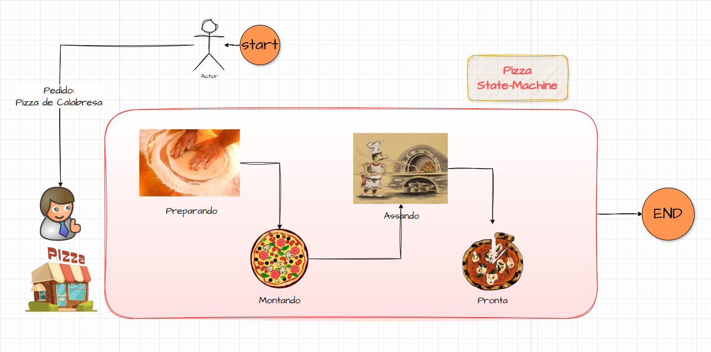
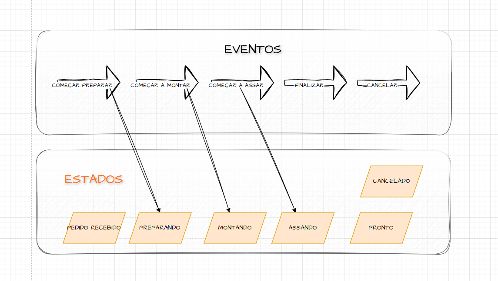

# 🍕 Java Pizza State Machine Series

This is a practical project that demonstrates how to implement a **State Machine** using **Java**. 

The example simulates a pizza order flow, going through states like `ORDER_RECEIVED`, `PREPARING`, `ASSEMBLING`, and `BAKING`, until reaching `READY` or being `CANCELLED`.

### 🗺️ State Machine Diagrams
#### Flow Diagram

#### States and Events

### This project is divided into three modules:

1. [raw-statemachine](raw-statemachine/README.md): Manual implementation, no frameworks. 
2. [fw-statemachine](fw-statemachine/README.md): Implementation using Spring StateMachine-Framework.

> 📌 Check the README.md of each module for more details.
---

## 🎥 YouTube Series

This project is part of a **video series** on my [YouTube channel](https://www.youtube.com/@gabrielbragadev), aiming to:

- Teach the concept of state machines
- Show how to implement them manually
- Demonstrate how Spring can help simplify the setup and transitions

### 📺 Watch the episodes:
1. [What is a State Machine?](https://www.youtube.com/watch?v=SqTnB6Pn-Bk)

2. [Implementing a State-Machine manually in Java (No Frameworks)](https://www.youtube.com/watch?v=wrCdHYnlj14)

3. [This Spring Framework Is RARELY Used – And EXTREMELY Powerful | Spring State Machine in Practice!](https://youtu.be/vedmXkjZS9w)

---

## 👨‍💻 About the Author
I'm Gabriel, a backend developer passionate about bringing ideas to life through code!
Also a big fan of coffee ☕ and a good TV series 🎬.

**🔗 Connect with me: [LinkedIn](https://www.linkedin.com/in/gabriel-braga-da-silva/), [Twitter](https://x.com/gbraga_dev)** |
**📺 Subscribe: [YouTube Channel](https://www.youtube.com/@gabrielbragadev)**

> ➡️ If this project or the series helped you in any way, consider ⭐️ starring the repo and subscribing to the channel!

You can also:
- 🍕 Share it with other devs who want to learn about state machines
- 💬 Drop your feedback or suggestions — I'm always open to new ideas
- 📢 Tag me on LinkedIn if you implement your own version — I’d love to see it
